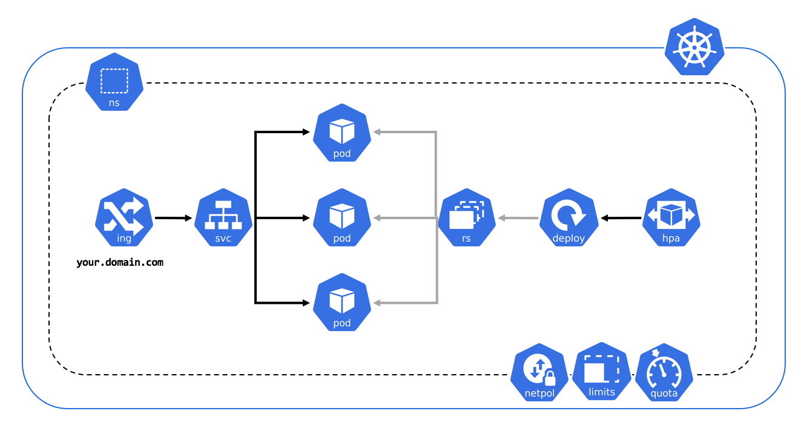

# Drupal
1. Revisar caso drupal en kubernetes y docker-compose

## 1 Arquitectura
1. Diagramar la arquitectura

## 2 Tools
1. [K8S Icons](https://github.com/kubernetes/community/tree/master/icons) - K8S Icons

